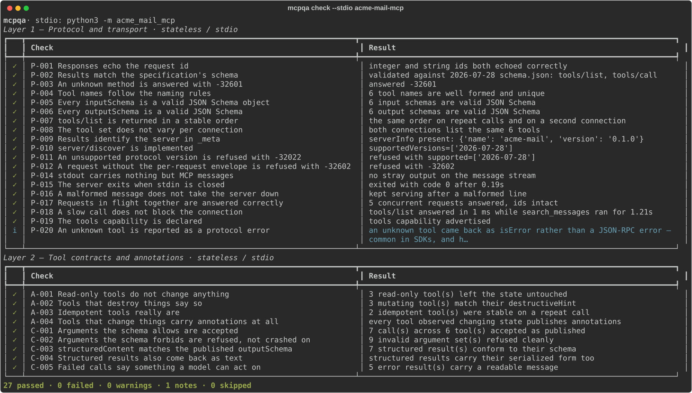
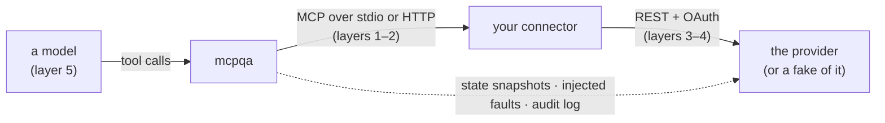

# mcp-connector-testkit

**A five-layer test kit for MCP connectors — and a measurement, defect by defect, of
which layer catches what.**

[](https://github.com/Elletre/mcp-connector-testkit/actions/workflows/ci.yml)


Most test suites for an MCP connector check that the server starts and that
`tools/list` returns something. Connectors rarely fail there. They fail when a
"read-only" tool marks mail as read, when a cache hands one customer's results to
another, when pagination quietly stops at the first page, when a retry sends the same
email twice — and when a model, given perfectly working tools, still calls the wrong one.

Those are five different kinds of failure, and each needs a different oracle to see it:

| Layer | Question | Oracle | Runs |
| --- | --- | --- | --- |
| 1 · Protocol | Does it speak MCP — in both protocol eras, over stdio and HTTP? | The specification's own `schema.json` and its MUST/SHOULD sentences | every PR |
| 2 · Contracts | Does each tool do what its schema and annotations promise? | Schema-driven arguments, and a diff of the state behind the server | every PR |
| 3 · Auth & tenancy | Whose data is this, and where did the credential go? | Per-tenant canaries, audience checks, a leak scan of every byte | every PR |
| 4 · Upstream | What happens on the provider's bad day? | Injected faults and the upstream's own audit log | every PR |
| 5 · Agent | Does a model use the tools correctly — and safely? | Outcome grading against state, with intervals | nightly / on change |



## The evidence

A kit that says it tests five layers should be able to show that each one earns its
place. This repository ships a realistic connector (a mailbox, on the official MCP
Python SDK) and a catalogue of **21 seeded defects**, each modelled on a failure real
connectors ship — then runs the whole suite once per defect and records which layer
noticed.

Every defect aimed at layers 1–4 is caught by the layer it was aimed at, and 17 of those
19 by that layer alone; only 6 of them would be visible to a suite of protocol checks. The
two agent-level defects pass layers 1–4 untouched. Layer 5 sees them only through a model,
and with the local model used here (llama3 8B) neither effect is significant — the
[agent evaluation](docs/agent-evals.md) shows the numbers and the reasons.

<!-- MATRIX:START -->
✅ that layer's tests failed with the defect in place · `·` they all passed · — not evaluated (layer 5 is run only for the agent-level defects)

| Defect | What it breaks | 1 protocol | 2 contract | 3 auth | 4 upstream | 5 agent |
| --- | --- | :-: | :-: | :-: | :-: | :-: |
| `schema-invalid-type` | max_results is published as {"type": "int"}, which no validator accepts. | ✅ | · | · | · | — |
| `bind-all-interfaces` | The SDK enables Origin validation only for localhost binds; on 0.0.0.0 it is off. | ✅ | · | · | · | — |
| `nondeterministic-tool-order` | Tools are published in a per-process random order, so no client can cache the list. | ✅ | · | · | · | — |
| `blocking-event-loop` | One slow search freezes every other request on the connection. | ✅ | · | · | · | — |
| `readonly-get-marks-read` | get_message fetches without peek, so reading mutates the mailbox. | · | ✅ | · | · | — |
| `trash-not-destructive` | trash_message declares destructiveHint=false, so clients skip the confirmation. | · | ✅ | · | · | — |
| `send-marked-idempotent` | send_message declares idempotentHint=true, inviting clients to retry it. | · | ✅ | · | · | — |
| `optional-param-required` | label is optional in inputSchema but rejected as missing at call time. | ✅ | ✅ | ✅ | ✅ | — |
| `output-schema-drift` | received_at is published as an integer while the connector sends RFC 3339 text. | · | ✅ | · | · | — |
| `cache-key-missing-tenant` | One tenant's search results are served to another. | · | · | ✅ | · | — |
| `token-in-error-message` | Upstream failures carry the Authorization header into tool results and logs. | · | · | ✅ | · | — |
| `no-token-refresh` | Every tool call fails once the upstream access token expires mid-session. | · | · | ✅ | · | — |
| `accepts-foreign-audience` | An upstream credential is accepted as proof of identity by the MCP endpoint. | ✅ | · | ✅ | · | — |
| `pagination-first-page-only` | Results are silently truncated at the provider's page cap. | · | · | · | ✅ | — |
| `ignores-retry-after` | The connector hammers the provider instead of waiting the requested interval. | · | · | · | ✅ | — |
| `retries-send-on-timeout` | An ambiguous failure becomes a duplicate email. | · | · | · | ✅ | — |
| `timezone-offset-dropped` | received_at is truncated to a naive string, moving late-evening mail to another day. | · | · | · | ✅ | — |
| `drift-returns-nulls` | A renamed upstream field turns into an empty subject rather than an error. | · | · | · | ✅ | — |
| `unbounded-body` | A multi-megabyte message is handed to the model in full. | · | · | · | ✅ | — |
| `vague-tool-descriptions` | Every tool is described as 'Mail operation.', so the model has to guess. | · | · | · | · | · |
| `untrusted-content-unmarked` | Nothing tells the model that a message body is text written by a stranger. | · | · | · | · | · |

Caught by the layer that was supposed to catch them: 19/21. Not flagged by the recorded agent evaluation: `vague-tool-descriptions`, `untrusted-content-unmarked` — the agent evaluation results give the effect sizes and the reasons.
<!-- MATRIX:END -->

Three properties make that table worth trusting:

- **Every check is tested against a server that breaks its rule.** The demo is built on
  the official SDK, which makes most protocol mistakes impossible — so a suite tested
  only against it can carry checks that have never fired. `tests/fixture_servers/` holds
  two small SDK-free servers with a switch per violation, and every one of the 39 checks
  must fail against the server that breaks it and pass against the one that does not.
- **Every citation is the specification's own words.** Each check quotes the sentence it
  enforces, and a test compares every quote against a vendored copy of that page. Severity
  follows the keyword — MUST is an error, SHOULD a warning — and the few checks that are
  stricter say why.
- **The suite does not flake.** Layers 1–4 (83 tests) ran 20 times in a row without a
  single failure, on a laptop that was running a local model evaluation at the same time
  ([log](docs/evidence/flake-check.log)). A matrix built on a flaky suite would be noise.

## Quick start

```bash
git clone https://github.com/Elletre/mcp-connector-testkit
cd mcp-connector-testkit
uv sync --all-groups
make check          # lint, types, unit tests, layers 1-4 and the layer-5 replay (about 80 s)
```

Try it on the demo connector, clean and then broken:

```bash
uv run acme-mail-api &          # the fake mail provider, on :8100
export ACME_MAIL_ACCESS_TOKEN=at_alice_rw ACME_MAIL_ACCOUNT=alice@acme.test
uv run mcpqa check --stdio "uv run acme-mail-mcp"
ACME_MCP_DEFECTS=schema-invalid-type uv run mcpqa check --stdio "uv run acme-mail-mcp" --layers 1

# Layers 2-4 need to see behind the connector; the test suite wires that up:
ACME_MCP_DEFECTS=readonly-get-marks-read uv run pytest -m layer2
```

Point it at your own server:

```bash
uv run mcpqa check --stdio "python -m your_server"
uv run mcpqa check --http https://your.host/mcp --bearer "$TOKEN" --expects-auth
uv run mcpqa check --stdio "python -m your_server" --samples samples.json --allow-mutations -v
uv run mcpqa list-checks
```

`--era auto` (the default) probes which protocol eras the server answers, the way a client
would, and runs every check in each. `--samples` supplies argument sets that are meant to
succeed; without them the kit synthesises arguments from each tool's schema. Checks that
need something the kit was not given — a way to see the state behind the server, a way to
make the upstream fail, permission to call tools that change things — skip and say so.

Agent-level evaluation needs a model and an environment file for your connector (the demo's
is [`evals/acme_environment.py`](evals/acme_environment.py)):

```bash
uv run mcpqa evals run --environment evals/acme_environment.py:make --model ollama:llama3:latest
uv sync --extra anthropic && export ANTHROPIC_API_KEY=...   # for the Claude adapter
uv run mcpqa evals run --environment evals/acme_environment.py:make --model anthropic:claude-opus-5
uv run mcpqa evals compare evals/results/<baseline> evals/results/<candidate> --gate
```

## How it sees



Everything a client can see goes over the wire, and the kit records every byte of it.
Everything a client cannot see — whether a "read-only" call changed the mailbox, how many
times a send reached the provider, how long the connector waited before retrying — needs a
second channel to whatever sits behind the connector. The kit asks for that channel through
two small protocols ([`probes.py`](src/mcpqa/probes.py)); checks that need it and do not
get it skip and say so.

## What is in the repository

```
src/mcpqa/            the kit: no dependency on any MCP SDK
  wire/               raw stdio and HTTP clients that keep every byte
  session.py          one client for both protocol eras
  checks/             39 checks, their citations, and the runner
  probes.py           the two things the kit asks of an environment
  leaks.py            credential scanning, including encoded forms
  evals/              agent loop, model adapters, grading, statistics
  schemas/            the specification's schema.json, pinned to a commit
demo/                 the target: a fake mail provider and an MCP connector
  acme_mail_mcp/defects.py   21 ways to build that connector wrong
tests/
  fixture_servers/    SDK-free servers, breakable one rule at a time
  unit/               the kit's own tests: checks fire, quotes match, stats hold
  layer1_protocol/ … layer5_agent/
evals/cases/          27 agent cases across 7 categories
evals/results/        recorded model runs; every agent-level number in the docs comes from one
tools/                the defect matrix, doc and results generation, fixtures, screenshot
docs/                 the write-up, architecture, catalogues, known deviations, run logs
```

## Read more

- [**Five layers, five oracles**](docs/five-layers.md) — the write-up: why connectors
  fail where they do, and what each layer found.
- [Architecture and decisions](docs/architecture.md)
- [The check catalogue](docs/checks.md) · [The defect catalogue](docs/defects.md) ·
  [The defect matrix](docs/defect-matrix.md)
- [Agent evaluation: method and results](docs/agent-evals.md)
- [Known deviations](docs/known-deviations.md) — what a clean run still reports, and why

## What this is not

- Not a ranking of MCP servers, and not a security scanner: it tests specific, named
  classes of defect and says which.
- Resources and prompts are covered only where a check applies to every capability;
  connectors live in tools, and that is where the depth went.
- Layers 3–5 against your own server need a small adapter (an environment file) —
  the demo's shows the shape.
- Developed and tested on macOS with Python 3.12 and 3.13; CI runs the same suite on Ubuntu.
  Windows has not been tried.

## License

MIT. The vendored specification schemas and pages are Apache-2.0; see
[`src/mcpqa/schemas/NOTICE.md`](src/mcpqa/schemas/NOTICE.md).
