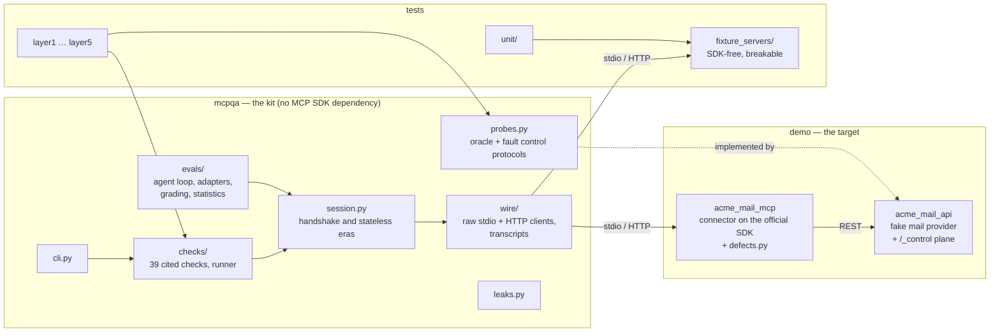

# Architecture and the decisions behind it

## The pieces

`mcpqa` is the product. `demo/` exists so the product has something realistic to be
pointed at, and so there is a place to seed defects that look like the ones real
connectors ship. The kit never imports the demo; the demo's control plane implements
the kit's two small protocols by shape alone.

## Decisions

### A raw client instead of the SDK's

The official client is written to get work done: it fills in missing fields, skips
lines it cannot parse and hides transport details. A conformance tool needs the opposite
— every byte, including the ones that should not be there. `mcpqa.wire` is plain
subprocess and `httpx2` code that records every exchange, and the kit validates what it
receives against the specification's own `schema.json` (vendored, pinned to a commit).
The side effect is that every failing check can print the exact request and response
that failed it.

### Checks quote the specification, and a test holds them to it

Each check carries a verbatim sentence of the specification. It is easy, while writing
a check, to "quote" from memory and drift into a paraphrase that the specification never
said; `tests/unit/test_spec_quotes.py` compares every quote against a vendored copy of
the page it links to, and the same test enforces the severity policy: MUST is an error,
SHOULD is a warning, anything stricter needs a written reason (`ESCALATIONS` in
`checks/citations.py`). Several citations in the first draft of this kit were paraphrases
of that kind; the test exists so that cannot happen again unnoticed.

### Every check is tested against a server that breaks it

`tests/fixture_servers/` holds two small servers written without the SDK, each with a
`MINI_BREAK` switch per violation. `test_checks_fire.py` runs every check against the
server that breaks its rule and requires it to fail, and against the clean server and
requires it to pass. The demo connector cannot serve this purpose because the SDK makes
most protocol violations impossible — which is also why a suite that only ever runs
against SDK-built servers can carry checks that have never fired.

### State diffs as the oracle for side effects

Tool annotations make claims about side effects: read-only, additive, destructive,
idempotent. The kit checks them against the state behind the server, represented as a
set of facts. The definitions reduce to set operations — read-only means an empty diff,
destructive means a fact disappeared, idempotent means a second call changes nothing —
so the kit never needs to know what a tool is for. For a real connector the oracle is
usually "list the objects in a test account through the provider's API".

### Defects are swapped components, not `if` statements

The connector is assembled from named parts (`Components` in `service.py`): paginator,
retry policy, response validator, date normaliser, body budget, cache key, client class.
A defect replaces one part with a broken variant that lives in `defects.py`. The clean
connector contains no branches for its broken versions, and the defect catalogue reads
as a list of design decisions someone could get wrong.

### Two protocol eras, one set of checks

Protocol revision 2026-07-28 removed the `initialize` handshake and sessions; earlier
revisions require them. A `Session` speaks either era and the checks are written against
the session, so each check runs in both eras unless the rule belongs to one of them. The
runner establishes which eras a server answers the way a client would, with a
`server/discover` probe.

### Agent evaluation graded by outcome

Layer 5 grades what happened to the mailbox, not how the model phrased its answer: "trash
the newsletter" passes when exactly that message moved to the trash. Every trial runs
against a freshly reset provider and a new connector process. Pass rates carry Wilson
intervals over cases, and runs are compared case by case with a bootstrap that resamples
cases, not trials, because repeats of a case are not independent. Model adapters are small
(four methods) and a recording of any run can be replayed deterministically, which is how
CI tests the evaluation pipeline without a model.

The agent loop is kept as ignorant as a generic client: its system message says nothing
about mail or about untrusted content, and everything else the model knows comes from the
server — its `instructions`, its tool descriptions, its results. A harness that adds
domain knowledge gets credited with the connector's work; the first version of this one
did exactly that, for one of the very defects it was built to measure.

## What is deliberately missing

- Resources and prompts are covered only where a check applies to every capability;
  connectors live in tools, so that is where the depth went.
- No Windows support has been tested.
- Layer 3 and 4 scenarios are written for the demo's provider. The patterns — canaries
  per tenant, audit-log assertions, fault injection by path — transfer; the tests do not.
